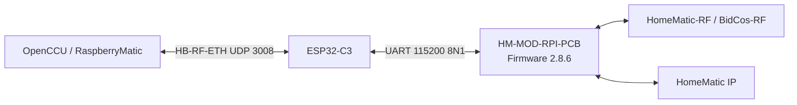

# HM-MOD ESP32-C3 Gateway

WLAN-Netzwerk-Gateway für das **eQ-3 HM-MOD-RPI-PCB** mit **ESP32-C3** und
**HB-RF-ETH / UDP 3008**. Der Aufbau wurde mit **OpenCCU** praktisch getestet
und transportiert sowohl **HomeMatic-RF / BidCos-RF** als auch **HomeMatic IP**
über das originale eQ-3 Funkmodul.

> Status: **funktionierender Praxisaufbau**  
> Getesteter Gateway-Stand: **v3.1.1**  
> HM-MOD-RPI-PCB Firmware: **2.8.6**


## Funktionen

- ESP32-C3 als WLAN-Bridge für HM-MOD-RPI-PCB
- HB-RF-ETH kompatibler Transport auf **UDP 3008**
- UART zum Funkmodul mit **115200 8N1**
- Unterstützung für `DualCoPro_App` / Firmware **2.8.6**
- OpenCCU / RaspberryMatic Einbindung über `/dev/raw-uart`
- Web-Dashboard
- Funk- und Relay-Diagnose
- System-Log
- CRC-/Drop-Zähler
- WLAN-Reconnect und HB-RF-ETH-Reconnect-Härtung
- ESP32-Firmwareupdate über WebUI
- HM-MOD `.eq3` Firmware-Updater über WebUI
- Anzeige von Modulstatus, Firmware, Uptime, Heap und Traffic
- mDNS-Hostname

## Architektur



## Verdrahtung

| HM-MOD-RPI-PCB | ESP32-C3 | Funktion |
|---|---|---|
| Pin 1 | 3V3 | Versorgung |
| GND | GND | gemeinsame Masse |
| Pin 8 / HM_RX | GPIO5 / TX | ESP → HM |
| Pin 10 / HM_TX | GPIO6 / RX | HM → ESP |
| Pin 12 / RESET | GPIO7 | Reset, aktiv LOW |

```text
ESP GPIO5 TX  ---> HM Pin 8  RX
ESP GPIO6 RX  <--- HM Pin 10 TX
ESP GPIO7     ---> HM Pin 12 RESET
ESP 3V3      ---> HM Pin 1  3.3V
ESP GND      ---> HM GND
```

## Schnellstart

1. Arduino IDE: `ESP32C3 Dev Module`
2. `USB CDC On Boot = Enabled`
3. `Flash Size = 4 MB`
4. `Partition Scheme = Default 4MB with SPIFFS`
5. `firmware/stable/HM_MOD_ESP32C3_Gateway_v3_1_1.ino` flashen
6. WLAN konfigurieren
7. Gateway-IP im Router per DHCP-Reservation fest vergeben
8. In OpenCCU:

```text
Systemsteuerung
→ Erweiterte Einstellungen
→ IP-Adresse (HB-RF-ETH)
```

9. OpenCCU neu starten.
10. Im Gateway prüfen:

```text
1 verbunden / 1 gestartet
DualCoPro_App
Firmware 2.8.6
CRC-Fehler 0
Drops 0
```

## Erfolgreicher Praxistest

Im Test wurde das Modul von OpenCCU als `HM-MOD-RPI-PCB (2.8.6)` über
`HB-RF-ETH` erkannt. Danach ließ sich ein vorhandenes BidCos-RF-Thermostat
wieder schalten; die Traffic-Zähler liefen in beide Richtungen.


## Dokumentation

- [Projektübersicht](docs/00_START_HIER.md)
- [Schnellstart](docs/01_SCHNELLSTART.md)
- [Hardware & Verdrahtung](docs/02_HARDWARE_VERDRAHTUNG.md)
- [Arduino flashen](docs/03_ARDUINO_FLASHEN.md)
- [OpenCCU einrichten](docs/04_OPENCCU_EINRICHTUNG.md)
- [HM-MOD Firmware 2.8.6](docs/05_HM_MOD_FIRMWARE_2_8_6.md)
- [WebUI & Diagnose](docs/06_WEBUI_DIAGNOSE.md)
- [Fehlerbehebung](docs/07_FEHLERBEHEBUNG.md)
- [Backup & Wiederherstellung](docs/08_BACKUP_WIEDERHERSTELLUNG.md)
- [Quellen & Referenzen](docs/09_QUELLEN_REFERENZEN.md)
- [Changelog](docs/10_CHANGELOG.md)

## Bekannte Punkte

- Die passive HmIP-Adressanzeige der v3.1.1-WebUI kann einen falschen Wert
  übernehmen. Für die korrekte RF-Adresse ist die OpenCCU-Hardwareinfo maßgeblich.
- Während OpenCCU aktiv verbunden ist, sollten `HM-Modul Reset` und
  `Modulinfo neu lesen` nicht unnötig benutzt werden.
- Die WebUI besitzt derzeit keine Anmeldung. Das Gateway sollte deshalb nur in
  einem vertrauenswürdigen LAN betrieben und nicht direkt ins Internet
  freigegeben werden.
- Der Titel der getesteten v3.1.1 kann an einzelnen Stellen noch `v3.1` anzeigen;
  das ist nur kosmetisch.

## HM-MOD Firmware 2.8.6

Die offizielle eQ-3/OCCU-Datei wird **nicht** in diesem Repository gespiegelt.

Dateiname:

```text
dualcopro_si1002_update_blhm.eq3
```

Offizielle Quelle:

https://raw.githubusercontent.com/eq-3/occu/master/firmware/HM-MOD-UART/dualcopro_si1002_update_blhm.eq3

## Referenzprojekte

Dieses Projekt entstand auf Basis öffentlich dokumentierter Protokolle und
praktischer Tests. Besonders hilfreich waren:

- https://github.com/alexreinert/HB-RF-ETH
- https://github.com/alexreinert/piVCCU
- https://github.com/Xerolux/HB-RF-ETH-ng
- https://github.com/tostmann/RFNETHM
- https://github.com/dettmering/hmcfgusb
- https://github.com/eq-3/occu

Die jeweiligen Drittprojekte bleiben unter ihren eigenen Lizenzen.

## English summary

This repository contains a tested **ESP32-C3 Wi-Fi HB-RF-ETH gateway** for the
**eQ-3 HM-MOD-RPI-PCB** radio module. It was validated with OpenCCU, firmware
2.8.6 (`DualCoPro_App`), BidCos-RF and HomeMatic IP. See the German
documentation for the complete build and troubleshooting notes.

## License notice

No standalone license has been selected for the original project files yet.
Third-party projects and firmware remain under their respective licenses.
See [`THIRD_PARTY.md`](THIRD_PARTY.md).
